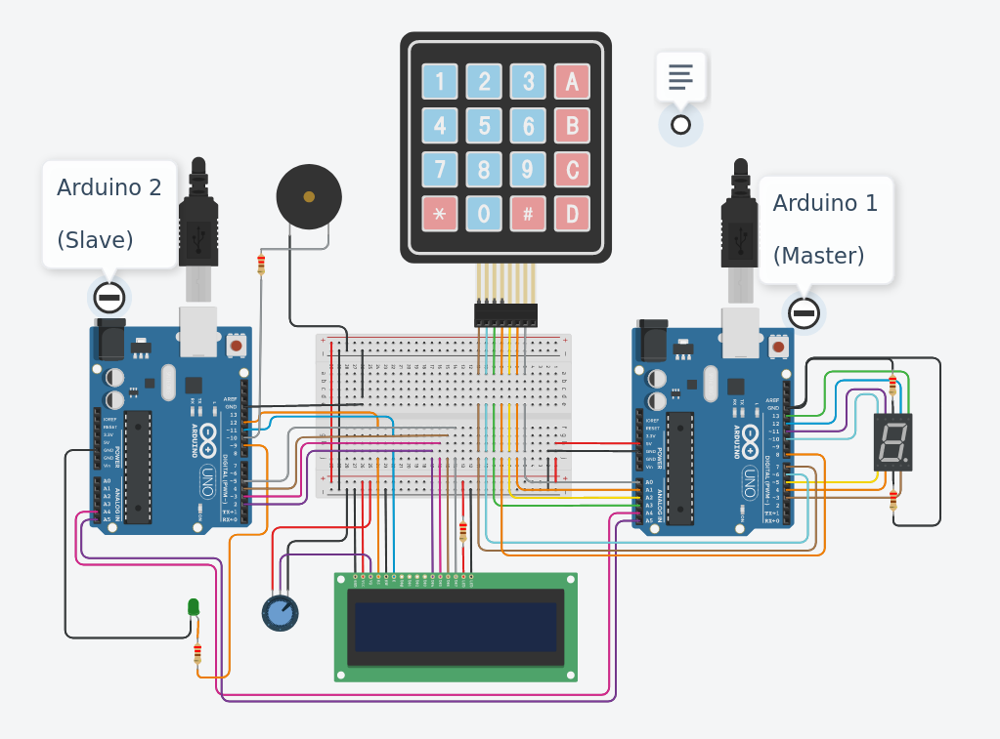
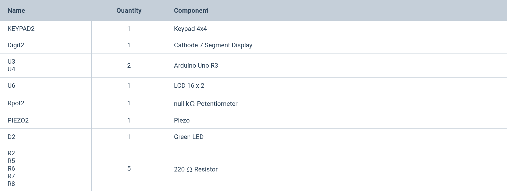

# Arduino Memory Game

## Description

The following Embedded System Project is inspired from the [Simon Memory Game](https://en.wikipedia.org/wiki/Simon_(game)). The System outputs a sequence of digits (0-9) inclusive one at a time, which user has to imitate from starting by tapping the keys on the keypad until the user tap the wrong key at some point. Points are recorded after each right answer and green led glows, total score is shown after tapping the wrong key with buzzer being active for approx 1 second. Refer this link to check out the woring prototype [Project Link](https://www.tinkercad.com/things/eYB30KqzbIw-swanky-uusam/editel)

## Motivation

After long hours of research work and surveys have gone into study of attention span of humans, its very concerning to say that over years the attention span has declined. Attention is an imperative part in any field, lack of it could result in terrible events. And one way to increase memory span is memory game, which forces the user to remember the past events along with focus on present event, and then consolidate them both and present it out. And hence this was the motivation behind designing Arduino Memory Game.

## Technologies Used

[Tinkercad](https://www.tinkercad.com/dashboard) was used to design the circuit, and then simulate thereof. This platform has wide array of useful modules and components that one may need to build basic Embedded system project especially using Arduino. And hence this is the best place to debug your code and check your circuit design before implementing it by physical means which may involve harm to certain electronic components.

Two Arduino boards have been used in this project. Main Arduino board (Master) handles the services of keypad and 7 segment display along with that it also manages the list of correct answers by the user. After every correct or incorrect tap, Master sends a code to Slave, code defines whether the tapped key is correct or incorrect and Slave then modifies the score accordingly, with that it also handles the functionality of LCD, led and buzzer.

Following is the list of components used

