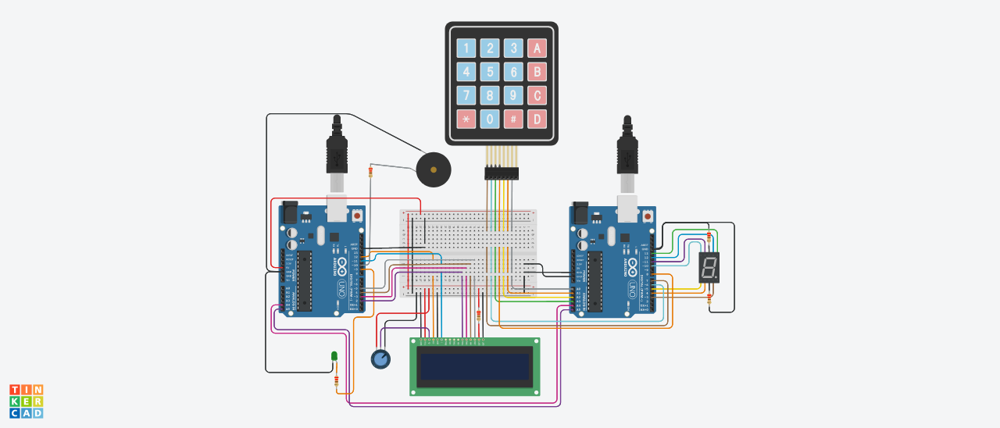

# Arduino Memory Game

User has to imitate the sequence of numbers produced by the arduino game until user taps the wrong number.

Points would be shown onto lcd screen. The following uses the I2C connection.
